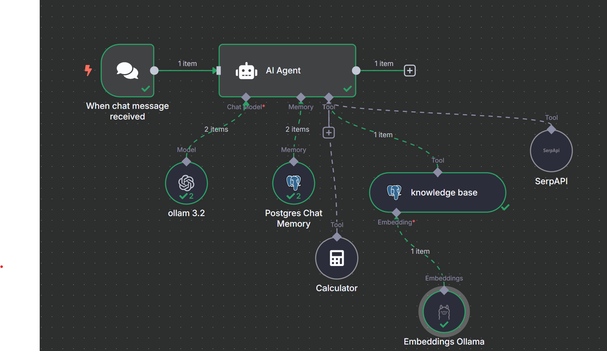

# 🧠 Local AI Chatbot with Custom Knowledge Base

A fully local, open-source AI chatbot using **n8n**, **Ollama (LLaMA 3.2)**, **PGVector**, and custom document embeddings. It mimics ChatGPT-like interaction using your private documents—free, private, and self-hosted.

---

## 📌 Features

- 📁 Upload and query your own documents as a knowledge base
- 🤖 Local LLM integration via Ollama (LLaMA 3.2 3B)
- 🧠 Text embeddings using `nomic-embed-text:v1.5`
- 🧮 Calculator tool, 🌐 SerpAPI, and 📚 PGVector integration
- 🛡️ Fully open-source and privacy-respecting
- ⚙️ Powered by [n8n.io](https://n8n.io/) – no coding required

---

## 🛠️ Tech Stack

| Tool | Purpose |
|------|---------|
| **n8n** | Workflow orchestration |
| **Ollama (LLaMA 3.2)** | Local LLM chatbot |
| **nomic-embed-text** | Text embeddings |
| **Postgres + PGVector** | Vector storage for document search |
| **Docker** | DB container setup |
| **SerpAPI (optional)** | Internet-enabled AI responses |

---

## 🚀 Installation Guide

```bash
# 1. Run Ollama with required models
ollama run llama3.2:3b
ollama run nomic-embed-text:v1.5

# 2. Launch PGVector using Docker
docker run -d --name pgvector-db -p 5432:5432 -e POSTGRES_PASSWORD=yourpassword ankane/pgvector

# 3. Start n8n (ensure Node.js is installed)
npx n8n start
```

---

## 🔧 Workflows Overview

### 🗂 Document Upload Flow
Handles form upload, embedding generation, and storage in PGVector.


---

### 💬 AI Chatbot Flow
Processes incoming messages and queries your knowledge base locally.



---

## 📂 Files Included

- `add_documents.json` – Document upload workflow
- `local_AI_chatbot_with_custom_knowledge_base.json` – AI chatbot workflow
- `readme.md` – This documentation
- Workflow PNGs – System visuals

---

## 📌 Future Enhancements

- Support for additional open-source LLMs depending on system requirements

- Web UI (e.g. Streamlit or Flask-based front-end)
- Other powerful open source LLM can be used.

---

## 📃 License

This project is licensed under the MIT License. Contributions are welcome!

---

## 🙌 Credits

Built using open tools by [Hemal Nakrani](https://github.com/HEMAL60) 🎓 MSc AI, Birmingham City University.
